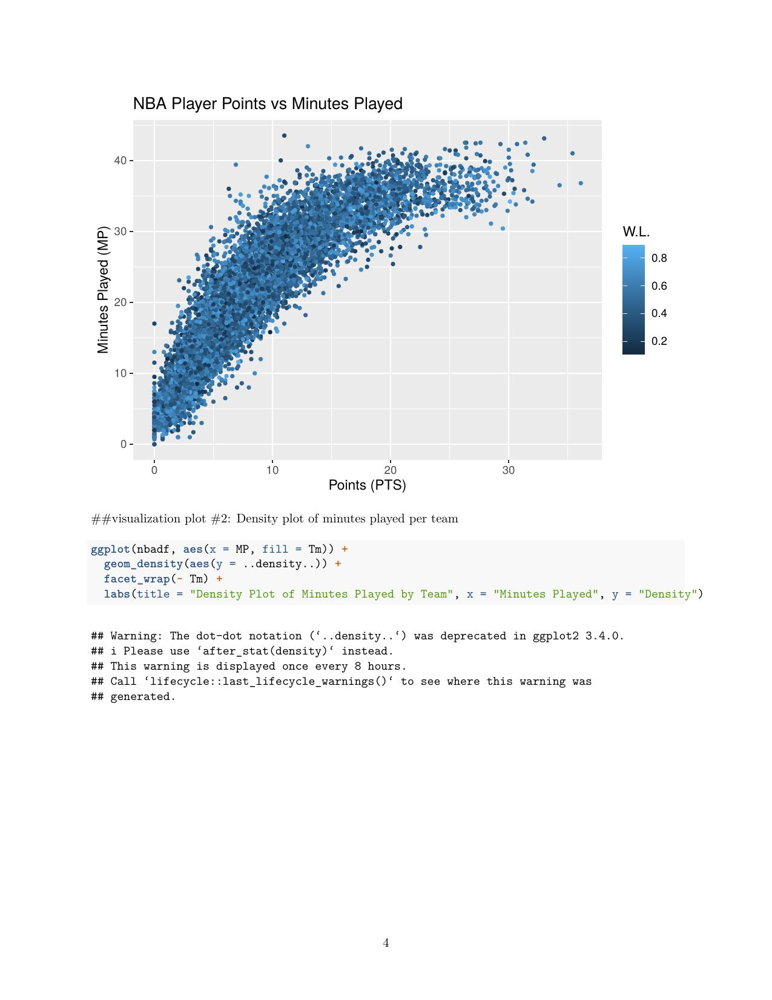
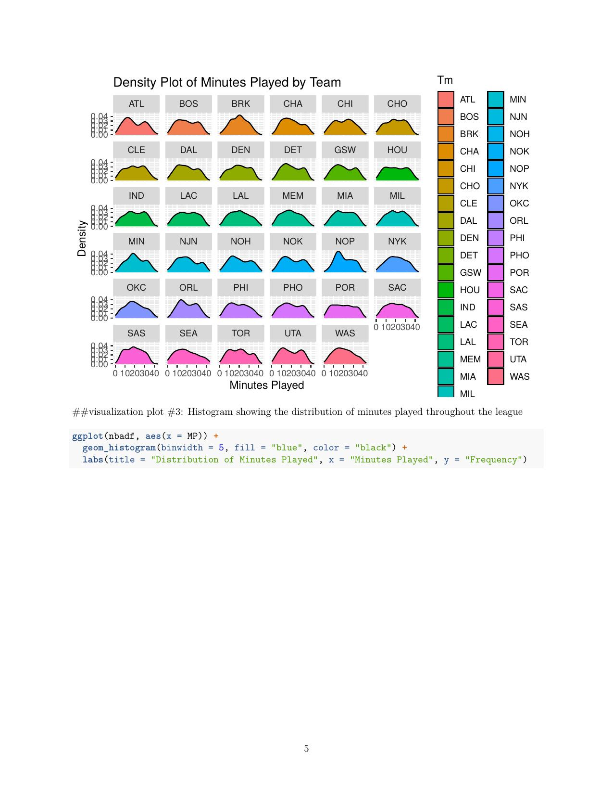
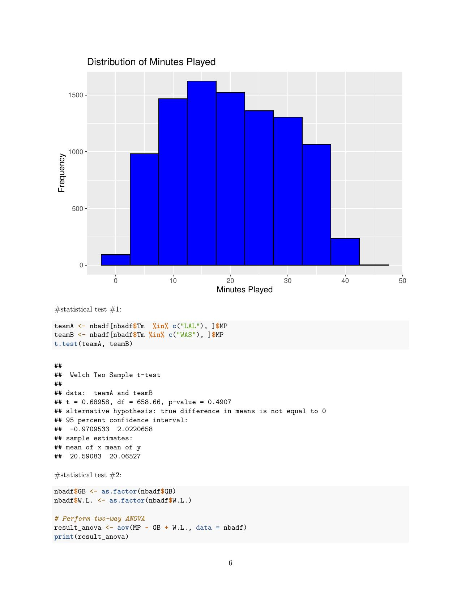

# NBA Minutes Played Analysis

Can a player's on-court statistics predict whether their playing time is actually deserved — and does that relate to team success?

## Overview

Using 20 years of NBA player statistics, this project explores whether the amount of playing time (minutes per game) a player receives lines up with their statistical contribution, and whether teams with more "earned" minutes distributions tend to win more.

**Question:** Can minutes-played rotation be predicted from player stats in a way that could help teams optimize playing time?

## Dataset

- ~9,660 player-season records spanning 2003–2022
- Source: Kaggle (originally scraped from Basketball-Reference.com)
- Features: minutes played, effective field goal %, three-point %, rebounds, assists, steals, blocks, points, team win-loss record, games behind
- *Data file not included in this repo — see [Reproducing](#reproducing) below*

## Exploratory Analysis

**Points vs. Minutes Played, colored by team win %**
Outliers in minutes or scoring tend to correlate with *lower* winning percentages — suggesting over-reliance on one or two players may hurt team success more than it helps.



**Minutes Played distribution by team**
Successful teams (Milwaukee, Miami, Boston) tend to show a plateau at the top of their minutes distribution — a more even rotation. Weaker teams (Atlanta, Brooklyn, Orlando) show an outlying hump, suggesting heavier reliance on fewer players.



**League-wide distribution of minutes played**
Right-skewed, as expected — most players are role players (10-15 min/game), with a small number of high-minute stars.



**Statistical tests:**
- Two-sample t-test (Lakers vs. Wizards minutes): p = 0.49 — no significant difference in raw playing time between a top and bottom franchise
- Two-way ANOVA (minutes ~ games behind + win-loss): win-loss record has a more direct relationship to minutes played than games behind first place

## Models

Three models were built to predict or classify minutes played from performance stats (3P%, eFG%, rebounds, assists, steals, blocks, points):

| Model | Metric | Result |
|---|---|---|
| SVM (Gaussian kernel) | RMSE | 2.50 minutes |
| Linear Regression | R² | 0.87 |
| Decision Tree (C5.0, high/low minutes classification) | Accuracy | 92% |

The linear regression model showed steals and 3-point percentage as the strongest positive predictors of minutes played, while blocks and overall shooting percentage had little impact — a somewhat counterintuitive finding worth digging into further.

## Repo structure

```
├── scripts/
│   ├── ExploratoryAnalysis.Rmd   # EDA: summary stats, visualizations, hypothesis tests
│   └── Models.Rmd                # SVM, linear regression, and decision tree models
├── figures/                      # Exported chart images used in this README
├── reports/
│   ├── FinalReport.docx          # Full written report
│   ├── ExploratoryAnalysis.pdf   # Knitted EDA output
│   └── Models.pdf                # Knitted model output
└── presentation/
    └── FinalProjectPresentation.pptx
```

## Reproducing

This project uses R with the following packages: `caret`, `ggplot2`, `naivebayes`, `C50`, `Metrics`.

1. Download the NBA player stats dataset from Kaggle and save it as `NBAPlayerData.csv`
2. Open `scripts/ExploratoryAnalysis.Rmd` and `scripts/Models.Rmd` in RStudio
3. Update the working directory path at the top of each file to point to your data
4. Knit to reproduce the analysis

## Notes

This was originally a course project (UNT, DTSC 3010). The code and structure are shown as-is to demonstrate the analysis process, not as production-grade software.
